## Deep Dream :computer: + :ocean::zzz: = :heart:
This repo contains a PyTorch implementation of the Deep Dream algorithm (:link: blog by [Mordvintstev et al.](https://ai.googleblog.com/2015/06/inceptionism-going-deeper-into-neural.html)).

It's got a full support for the **command line** usage and a **Jupyter Notebook**!

And it will give you the power to create these weird, psychedelic-looking images:

<p align="center">
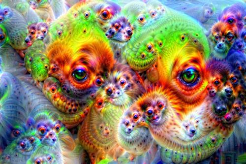
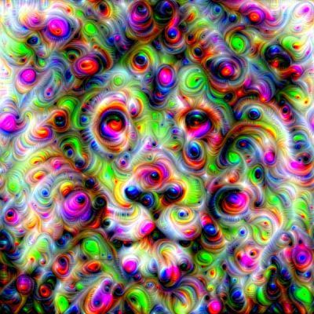
</p>

Not bad, huh?

I strongly suggest you start with the [Jupyter notebook](https://github.com/gordicaleksa/pytorch-deepdream/blob/master/The%20Annotated%20DeepDream.ipynb) that I've created!

*Note: it's pretty large, ~10 MBs, so it may take a couple of attempts to load it in the browser here on GitHub.*

## Table of Contents
* [What is DeepDream?](#what-is-deepdream-algorithm)
    * [Image visualizations and experiments](#static-image-examples)
    * [Ouroboros video examples](#ouroboros-video-examples)
    * [DeepDream video examples](#deepdream-video-examples)
* [Setup](#setup)
* [Usage](#usage)
* [Hardware requirements](#hardware-requirements)
* [Learning material](#learning-material)

### What is DeepDream algorithm?
In a nutshell the algorithm maximizes the activations of chosen network layers by doing a **gradient ascent**.

So from an input image like the one on the left after "dreaming" we get the image on the right:
<p align="center">
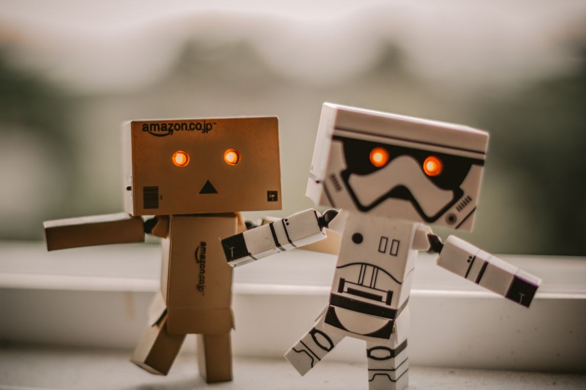
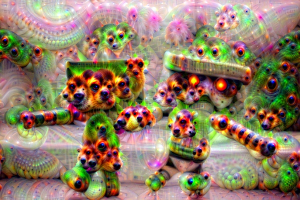
</p>

Who would have said that neural networks had this creativity hidden inside? :art:

#### Why yet another Deep Dream repo?

Most of the original Deep Dream repos were written in **Caffe** and the ones written in PyTorch are usually really hard to read and understand.
This repo is an attempt of making the **cleanest** DeepDream repo that I'm aware of + it's written in **PyTorch!** :heart:

## Static Image Examples

Here are some examples that you can create using this code!

### Optimizing shallower layers = Amplify low-level features

By using shallower layers of neural networks you'll get lower level patterns (edges, circles, colors, etc.) as the output:

<p align="center">
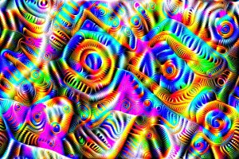
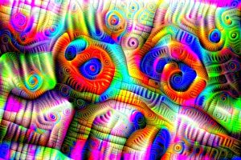
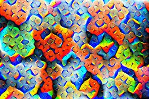
</p>

Here the first 2 images came from ResNet50 and the last one came from GoogLeNet (both pretrained on ImageNet).

### Optimizing deeper Layers = Amplify high-level features

By using deeper network layers you'll get higher level patterns (eyes, snouts, animal heads):

<p align="center">
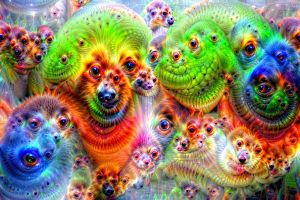

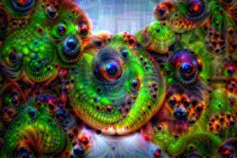
</p>

The 1st and 3rd were created using VGG 16 (ImageNet) and the middle one using ResNet50 pretrained on Places 365.

### Dataset matters (ImageNet vs Places 365)

If we keep every other parameter the same but we swap the pretrained weights we get these:

<p align="center">
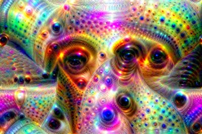
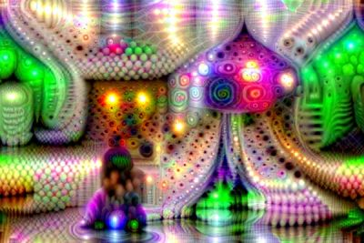
</p>

Left: **ResNet50-ImageNet** (we can see more animal features) Right: **ResNet50-Places365** (human built stuff, etc.).

### Impact of increasing the pyramid size

Dreaming is performed on multiple image resolutions stacked "vertically" (we call this an **image pyramid**).

<p align="center">
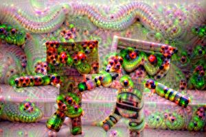
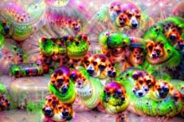
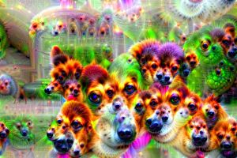
</p>

Going from left to right the only parameter that changed was the pyramid size (from left to right: 3, 7, 9 levels).

### Impact of increasing the pyramid ratio

Playing with pyramid ratio has a similar/related effect - the basic idea is that the relative area of the image which the deeper neurons can modify and "see"
(the so-called **receptive field** of the net) is increasing and we get increasingly bigger features like eyes popping out (from left to right: 1.1, 1.5, 1.8):

<p align="center">
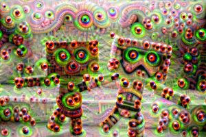
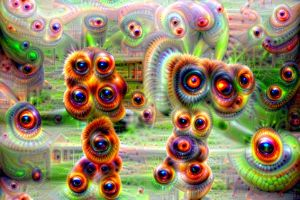
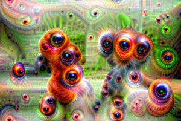
</p>

**Note: you can see the exact params used to create these images encoded into the filename!**

Make sure to check out the [Jupyter notebook!](https://github.com/gordicaleksa/pytorch-deepdream/blob/master/The%20Annotated%20DeepDream.ipynb), I've explained this thoroughly.

## Ouroboros Video Examples

Here are some further examples that you can create using this code!

The idea here is that whatever the network dreams just feed that back to it's input and apply a geometric transformation.

### Ouroboros: Zoom transform

If we apply only central zoom we get this:


### Ouroboros: Zoom and Rotation transforms

Applying central zoom and at the same time applying a 3 degree rotation per frame yields this:


### Ouroboros: Translation 

Finally if we do a simple translation (5 px per frame top left to bottom right direction):


Hopefully these did not break your brain - it feels like web 1.0 early 2000s. Bear with me.

## DeepDream Video Examples

Instead of feeding the output back to input we just apply the algorithm per frame and apply some linear blending:

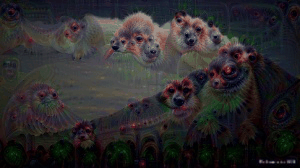

Linear blending just combines the current frame with the last one so as to reduce the flicker (here I used 0.85)

*Note: all of the deepdream images/GIFs were produced by me, credits for original image artists [are given bellow](#acknowledgements).*

## Setup

1. `git clone https://github.com/gordicaleksa/pytorch-deepdream`
1. Open Anaconda Prompt and navigate into project directory `cd path_to_repo`
2. Run `conda env create` from project directory (this will create a brand new conda environment).
3. Run `activate pytorch-deepdream` (for running scripts from your console or setup the interpreter in your IDE)

That's it! It should work out-of-the-box executing environment.yml file which deals with dependencies.

*Note:* If you wish to use video functions I have - you'll need **ffmpeg** in your system path.

-----

PyTorch pip package will come bundled with some version of CUDA/cuDNN with it,
but it is highly recommended that you install a system-wide CUDA beforehand, mostly because of the GPU drivers. 
I also recommend using Miniconda installer as a way to get conda on your system.
Follow through points 1 and 2 of [this setup](https://github.com/Petlja/PSIML/blob/master/docs/MachineSetup.md)
and use the most up-to-date versions of Miniconda and CUDA/cuDNN for your system.

## Usage

#### Option 1: Jupyter Notebook

Just run `jupyter notebook` from you Anaconda console and it will open up a session in your default browser. <br/>
Open `The Annotated DeepDream.ipynb` and you're ready to play!

**Note:** if you get `DLL load failed while importing win32api: The specified module could not be found` <br/>
Just do `pip uninstall pywin32` and then either `pip install pywin32` or `conda install pywin32` [should fix it](https://github.com/jupyter/notebook/issues/4980)!

#### Option 2: Use your IDE of choice

You just need to link the Python environment you created in the [setup](#setup) section.

#### Option 3: Command line

Navigate to/activate your env if you're using Anaconda (and I hope you do) and you can use the commands I've linked below.

---

**Tip: Place your images/videos inside the `data/input/` directory and you can then just reference 
your files (images/videos) by their name instead of using absolute/relative paths.**

### DeepDream images

To create some **static Deep Dream images** run the following command:

`python deepdream.py --input <img_name> --img_width 600`

This will use the default settings but you'll immediately get a meaningful result saved to:

`data/out-images/VGG16_EXPERIMENTAL_IMAGENET/`

*Note: the output directory will change depending on the model and pretrained weights you use.*

### Ouroboros videos

To get the out-of-the-box **Ouroboros** 30-frame video do the following:

`python deepdream.py --input <img_name> --create_ouroboros --ouroboros_length 30`

It will dump the intermediate frames to `data/out-videos/VGG16_EXPERIMENTAL_IMAGENET/` and it will save the final video to `data/out-videos`.

### DeepDream videos

To create a **Deep Dream video** run this command:

`python deepdream.py --input <mp4 video name>`

It will dump the intermediate frames to `data/out-videos/tmp_out` and it will save the final video to `data/out-videos`.

---

Well, enjoy playing with this project! Here are some additional, beautiful, results:

<p align="center">
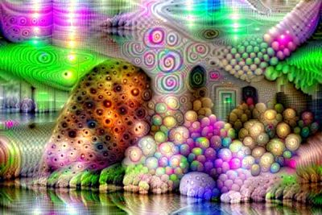
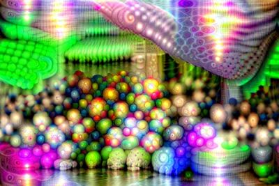
</p>

## Hardware requirements

A GPU with 2+ GBs will be more than enough.

You'll be able to create DeepDream images, Ouroboros and DeepDream videos.

If you don't have a GPU, the code will automatically run on the CPU but somewhat slower (especially for videos).

## Learning material

If you're having difficulties understanding DeepDream I did an overview of the algorithm [in this video](https://www.youtube.com/watch?v=6rVrh5gnpwk):

<p align="left">
<a href="https://www.youtube.com/watch?v=6rVrh5gnpwk" target="_blank"></a>
</p>

And also the [Jupyter Notebook](https://github.com/gordicaleksa/pytorch-deepdream/blob/master/The%20Annotated%20DeepDream.ipynb) I created is the best place to start!

## Acknowledgements

I found these repos useful (while developing this one):
* [deepdream](https://github.com/google/deepdream) (Caffe, original repo)
* [DeepDreamAnim](https://github.com/samim23/DeepDreamAnim) (Caffe)
* [AI-Art](https://github.com/Adi-iitd/AI-Art/blob/master/DeepDream.py) (PyTorch)
* [neural-dream](https://github.com/ProGamerGov/neural-dream) (PyTorch)
* [DeepDream](https://github.com/CharlesPikachu/DeepDream) (PyTorch)

I found the images I was using here:
* [awesome figures pic](https://www.pexels.com/photo/action-android-device-electronics-595804/)
* [awesome bridge pic](https://www.pexels.com/photo/gray-bridge-and-trees-814499/)

Other images are now already classics in the NST and DeepDream worlds.

Places 365 pretrained models came from [this awesome repo](https://github.com/CSAILVision/places365).

## Citation

If you find this code useful for your research, please cite the following:

```
@misc{Gordić2020DeepDream,
  author = {Gordić, Aleksa},
  title = {pytorch-deepdream},
  year = {2020},
  publisher = {GitHub},
  journal = {GitHub repository},
  howpublished = {\url{https://github.com/gordicaleksa/pytorch-deepdream}},
}
```

## Connect with me

If you'd love to have some more AI-related content in your life :nerd_face:, consider:
* Subscribing to my YouTube channel [The AI Epiphany](https://www.youtube.com/c/TheAiEpiphany) :bell:
* Follow me on [LinkedIn](https://www.linkedin.com/in/aleksagordic/) and [Twitter](https://twitter.com/gordic_aleksa) :bulb:
* Follow me on [Medium](https://gordicaleksa.medium.com/) :books: :heart:

## Licence

[](https://github.com/gordicaleksa/pytorch-deepdream/blob/master/LICENCE)